<div align="center">

# 📣 Ralia for Promoters

### Turn your audience into income — accept offers, post, submit proof, get paid.

<br/>


</div>

---

The **promoter** app is where creators and distributors earn. Sign up, get matched to campaigns
that fit your audience, accept an offer, post the creative, and submit a screenshot as proof.
Pay lands in your balance after an admin verifies it.

## 🧭 The promoter journey

```mermaid
flowchart LR
    S["📧 Sign up<br/>email OTP"] --> O["🧩 Onboard<br/>channels + profile"]
    O --> M{{"🎯 Matched to<br/>eligible campaigns"}}
    M --> A["✅ Accept offer"]
    A --> T["🗓️ Post on each<br/>scheduled day"]
    T --> U["📸 Submit proof<br/>per day"]
    U --> V{"🛡️ Admin verifies"}
    V -->|approved| Pay["💰 Paid pro-rata"]
    V -->|rejected| A2["↩️ Resubmit"]

    classDef pay fill:#dcfce7,stroke:#16a34a,color:#14532d;
    class Pay pay;
```



## 🗓️ Multi-day delivery timeline

A campaign can ask for several posts over a run window. Your assignment breaks into a **Day 1…N**
timeline — each day has its own deadline, its own status, and its own submit button. You're paid
**per approved day**.

```mermaid
flowchart LR
    D1["Day 1<br/>✅ approved"]:::ok --> D2["Day 2<br/>✅ approved"]:::ok --> D3["Day 3<br/>⏳ due today"]:::now --> D4["Day 4<br/>◻️ upcoming"]:::soon
    classDef ok fill:#dcfce7,stroke:#16a34a,color:#14532d;
    classDef now fill:#fef9c3,stroke:#ca8a04,color:#713f12;
    classDef soon fill:#f1f5f9,stroke:#94a3b8,color:#334155;
```



> Deadlines you see are an **internal** buffer — always earlier than the client's real end date, so
> there's room to recover a missed day. Miss two days in a row and the remaining posts are
> reassigned to keep the campaign on track.

## 🔒 Sign-up & verification

Verification is by **email OTP** — register, and a 6-digit code lands in your inbox. Your tracking
link (the one you share) routes through the API so your clicks count toward your pay.

## 🚀 Quickstart

```bash
npm install
cp .env.example .env     # set API_ORIGIN (defaults to http://localhost:6100)
npm run dev              # http://localhost:6400
```

Seeded logins: `promoter1@ralia.test` … `promoter40@ralia.test` · password `Password123!`

<details>
<summary><b>🔐 Environment</b></summary>

| Variable | Purpose |
|---|---|
| `API_ORIGIN` | The API origin the Next server proxies `/v1` + `/r` to |
| `NODE_ENV` | `production` in deploys |
</details>

<details>
<summary><b>🛠️ Scripts</b></summary>

| Script | Does |
|---|---|
| `dev` | dev server on :6400 |
| `build` | production build |
| `start:prod` | `node server.js` (only for a self-hosted Node host; Vercel builds natively) |
| `typecheck` | `tsc --noEmit` |
</details>

## 🚢 Deployment

Deploys to **Vercel** (native Next.js) — import the repo, set `API_ORIGIN` + `NEXT_PUBLIC_APP_ENV`, and Vercel builds each push. See `DEPLOY.md`.

---

<div align="center">
<sub>Part of Ralia · <a href="../ralia-api">API</a> · <a href="../ralia-client">Client</a> · <a href="../ralia-admin">Admin</a></sub>
</div>
